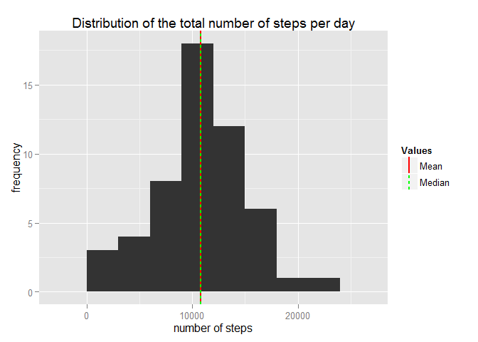
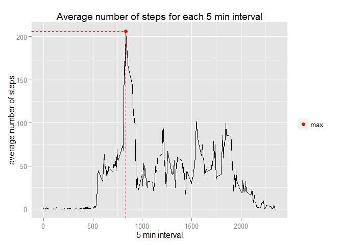
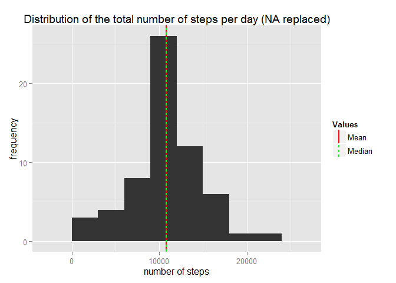
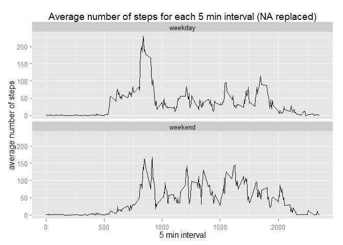

# Reproducible Research: Peer Assessment 1
Jan Herkelrath  
Thursday, October 16, 2014  


## Loading and preprocessing the data

In the first step the required libraries (ggplot2, dplyr and lubridate) are being loaded.

```r
library(ggplot2)
library(dplyr)
library(lubridate)
```

The dataset is being unziped if necessary and loaded into the variable data. 
After that the date column of the data is being transformed to a date-time class with the ymd() function of the lubridate package.

```r
if(!"activity.csv" %in% list.files()){
        unzip("activity.zip")
}
data <- tbl_df(read.csv("activity.csv"))
data$date <- ymd(data$date)
```

## What is mean total number of steps taken per day?
The original data.frame is grouped by date and the sum of the number of steps for each date are calculated while ignoring NA values.
The mean and the median of this distribution are calculated and saved in a dataframe.

```r
sumValues <- data %>%
                group_by(date) %>%
                filter(!is.na(steps)) %>%
                summarize(steps_sum=sum(steps, na.rm=TRUE))
                
lineValues <- tbl_df(data.frame(Values=c("Mean","Median"), 
                                vals=c(mean(sumValues$steps_sum, na.rm=TRUE), 
                                       median(sumValues$steps_sum, na.rm=TRUE))))
```

The mean and median values are as follows:

```r
lineValues
```

```
## Source: local data frame [2 x 2]
## 
##   Values     vals
## 1   Mean 10766.19
## 2 Median 10765.00
```

The Histogramm of this distribution is plotted and the median and mean values are overlayed as vertical lines.

```r
ggplot(sumValues, aes(x=steps_sum)) + 
        geom_histogram(binwidth=3000) + 
        geom_vline(data=lineValues, 
                   aes(xintercept=vals, linetype=Values), 
                   color=c("red","green"), 
                   size=1, 
                   show_guide=TRUE) +
        labs(x="number of steps", y="frequency", title="Distribution of the total number of steps per day")
```

 

## What is the average daily activity pattern?
The original data.frame is grouped by the interval column, NA values are filtered out and the mean is calculated for every interval and saved in a data.frame. After that the maximum value of this data.frame is calculated.

```r
meanValues <- data %>%
                group_by(interval) %>%
                filter(!is.na(steps)) %>%
                summarize(steps_mean=mean(steps, na.rm=TRUE))

maxValue <- summarize(meanValues, interval=interval[which.max(steps_mean)],max=max(steps_mean))
```

The maximum value and the corresponding interval are as follows:

```r
maxValue
```

```
## Source: local data frame [1 x 2]
## 
##   interval      max
## 1      835 206.1698
```

The time series is plotted and the maximum value is marked as a red point.

```r
ggplot(meanValues, aes(x=interval, y=steps_mean)) + 
        geom_line() +
        geom_point(data=maxValue, aes(x=interval, y=max, color="max"), pch=19, size=2.5) +
        geom_segment(data=maxValue, aes(x=interval, y=-Inf, xend=interval, yend=max), linetype=2, color="red") +
        geom_segment(data=maxValue, aes(x=-Inf, y=max, xend=interval, yend=max), linetype=2, color="red") +
        scale_color_manual(name="", values=c("max"="red")) +
        labs(x="5 min interval", y="average number of steps", title="Average number of steps for each 5 min interval")
```

 

## Imputing missing values
First, the total number of NA values in the steps column is calculated

```r
summarize(data, sum_NA=sum(is.na(steps)))
```

```
## Source: local data frame [1 x 1]
## 
##   sum_NA
## 1   2304
```

The missing values in the original dataset are replaced by the mean values of the number of steps of the corresponding time interval.

```r
data2 <- data

replace_function <- function(){
        index <- 1
        function(x){
                if(is.na(x)){
                        x <- meanValues$steps_mean[which(meanValues$interval==data2$interval[index])]
                }
                index <<- index + 1
                x
        }
}

data2$steps <- sapply(data2$steps, FUN=replace_function())
```

After that the total number of steps per day and their mean and median values are being calculated.

```r
sumValues2 <- data2 %>%
                group_by(date) %>%
                filter(!is.na(steps)) %>%
                summarize(steps_sum=sum(steps, na.rm=TRUE))
                
lineValues2 <- tbl_df(data.frame(Values=c("Mean","Median"), 
                                vals=c(mean(sumValues2$steps_sum), 
                                       median(sumValues2$steps_sum))))
```

The new median and mean values are as follows:

```r
lineValues2
```

```
## Source: local data frame [2 x 2]
## 
##   Values     vals
## 1   Mean 10766.19
## 2 Median 10766.19
```

The Histogramm of this distribution is plotted and the median and mean values are overlayed as vertical lines.

```r
ggplot(sumValues2, aes(x=steps_sum)) + 
        geom_histogram(binwidth=3000) + 
        geom_vline(data=lineValues2, 
                   aes(xintercept=vals, linetype=Values), 
                   color=c("red","green"), 
                   size=1, 
                   show_guide=TRUE) +
        labs(x="number of steps", 
             y="frequency", 
             title="Distribution of the total number of steps per day (NA replaced)")
```

 

It can be seen that the distribution is almost the same as the one without replacing the missing values. The only difference is that the median is now identical with the mean value and the mean is more emphasized. This can be explained by the way of replacing the missing values with the mean values of the intervals.

## Are there differences in activity patterns between weekdays and weekends?
First the weekdays factor variable is introduced into the dataset.

```r
data2 <- mutate(data2, weekdays=sapply(data2$date, FUN=function(x){
        if(wday(x)==1 || wday(x)==7){
                x <- "weekend"
        }else{
                x <- "weekday"
        }
        x
}))

data2$weekdays <- as.factor(data2$weekdays)
```

In the second step the mean values are calculated grouped by the interval and the weekdays variable.

```r
meanValues2 <- data2 %>%
        group_by(interval, weekdays) %>%
        summarize(steps_mean=mean(steps, na.rm=TRUE))
```

Finally the time series plot is created. The number of steps on weekends seems to be more evenly distributed compared to the number of steps on weekdays.

```r
ggplot(meanValues2, aes(x=interval, y=steps_mean)) + 
        geom_line() +
        facet_wrap(~ weekdays , ncol=1) +
        labs(x="5 min interval", 
             y="average number of steps", 
             title="Average number of steps for each 5 min interval (NA replaced)")
```

 

